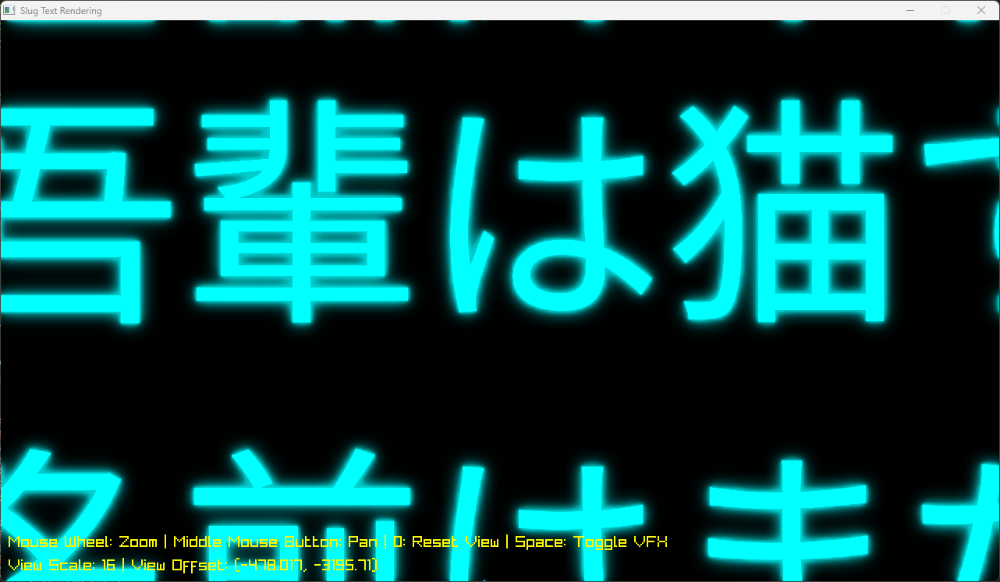

# slug-raylib

Slug text rendering algorithm implementation with Raylib.

Most of the work is done. However, few subtle issues remain. But I can't figure out why.

This implementation is based on Eric Lengyel's research. See: <https://github.com/EricLengyel/Slug> for details.

